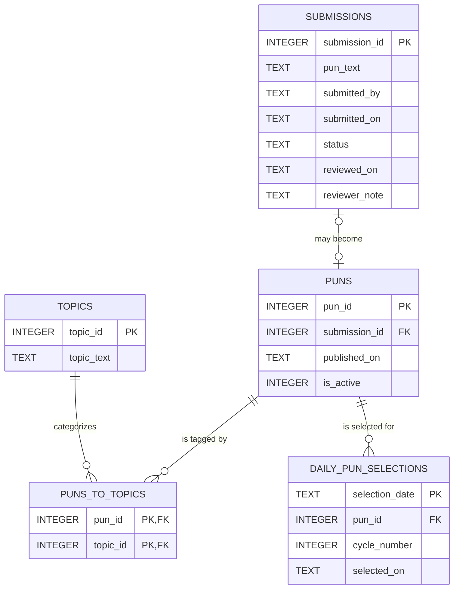

# Department of Puns database schema

Cloudflare D1 is the application's managed SQLite database. This document describes the schema currently used by the Department of Puns site.



## Review flow

1. A visitor's submission begins in `submissions` with a `pending` status.
2. The Pun-dent changes it to `approved` or `declined`.
3. An approved submission receives a row in `puns`; `submission_id` retains the review trail and determines which text and optional credit are published.
4. One or more entries in `puns_to_topics` determine the topic filters available on the public site.
5. The public API returns only active puns that have at least one topic.
6. The Pun of the Day API records its daily choice in `daily_pun_selections` and completes a full active-pun cycle before repeating one.

## D1 / SQLite definitions

```sql
CREATE TABLE submissions (
  submission_id INTEGER PRIMARY KEY,
  pun_text TEXT NOT NULL,
  submitted_by TEXT,
  submitted_on TEXT NOT NULL DEFAULT CURRENT_TIMESTAMP,
  status TEXT NOT NULL DEFAULT 'pending'
    CHECK (status IN ('pending', 'approved', 'declined')),
  reviewed_on TEXT,
  reviewer_note TEXT
);

CREATE TABLE puns (
  pun_id INTEGER PRIMARY KEY,
  submission_id INTEGER NOT NULL UNIQUE,
  published_on TEXT NOT NULL DEFAULT CURRENT_TIMESTAMP,
  is_active INTEGER NOT NULL DEFAULT 1
    CHECK (is_active IN (0, 1)),
  FOREIGN KEY (submission_id)
    REFERENCES submissions(submission_id)
);

CREATE TABLE topics (
  topic_id INTEGER PRIMARY KEY,
  topic_text TEXT NOT NULL COLLATE NOCASE UNIQUE
);

CREATE TABLE puns_to_topics (
  pun_id INTEGER NOT NULL,
  topic_id INTEGER NOT NULL,
  PRIMARY KEY (pun_id, topic_id),
  FOREIGN KEY (pun_id) REFERENCES puns(pun_id),
  FOREIGN KEY (topic_id) REFERENCES topics(topic_id)
);

CREATE TABLE daily_pun_selections (
  selection_date TEXT PRIMARY KEY
    CHECK (selection_date GLOB '????-??-??'),
  pun_id INTEGER NOT NULL,
  cycle_number INTEGER NOT NULL CHECK (cycle_number > 0),
  selected_on TEXT NOT NULL DEFAULT CURRENT_TIMESTAMP,
  FOREIGN KEY (pun_id) REFERENCES puns(pun_id),
  UNIQUE (cycle_number, pun_id)
);
```

## Not yet implemented

Groans/ratings and delivery notifications are intentionally not part of the current schema. They will be added through separate, reviewed migrations when those features are built.

The public submission form writes new records to `submissions` with the default `pending` status; it does not require another table. It includes server-side validation, Cloudflare Turnstile validation, and a basic bot trap.
